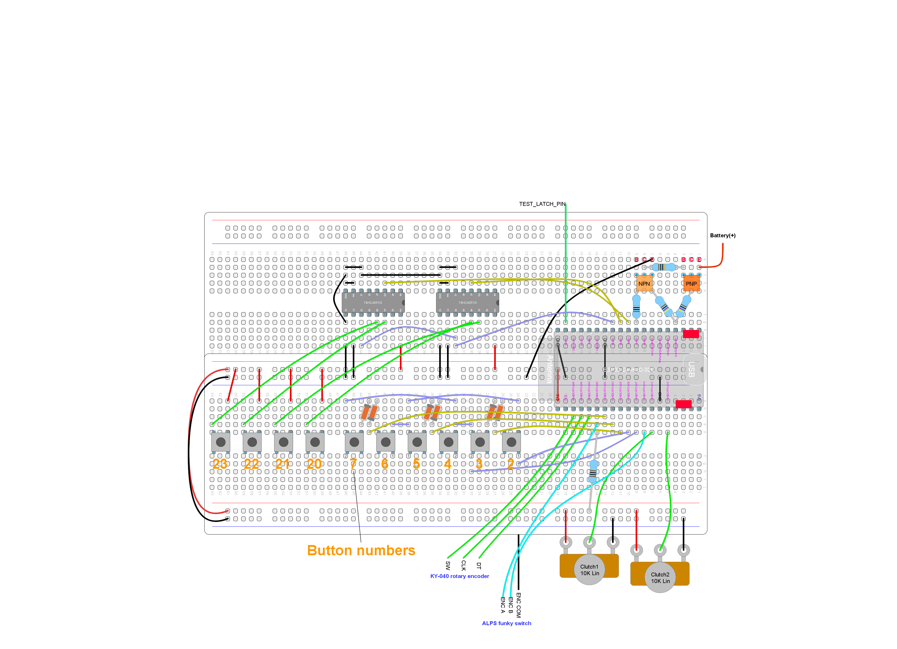

# Integration test: power, battery and digital clutch paddles

## Purpose and summary

To test battery level and power off from the config menu.

## Hardware setup

Actual GPIO numbers are defined at [debugUtils.h](./debugUtils.h).
Use this [test circuit](../../Protoboards/ESP32-WROOM-DevKitC-1.diy):

We are not using the potentiometers. For later reference (this differs from previous tests):

- "CLUTCH1" is the button mumbered #2 in the protoboard.
- "CLUTCH2" is the button mumbered #3 in the protoboard.
- "Cycle CF" is the combination of buttons #7 and #6 in the protoboard.
- "RSW" is the built-in push button of the rotary encoder.
- "RCW" means rotary's clockwise rotation.
- "RCCW" means rotary's counter-clockwise rotation.

## Software setup (computer)

- Windows 10 or later
- Bluetooth 4.2 or later
- Joystick testing software from Planet's Pointy ( [http://www.planetpointy.co.uk/joystick-test-application/](http://www.planetpointy.co.uk/joystick-test-application/) ) or any other able to display 128 buttons. Note that Window's device property page is not suitable for this.

## Before start

- Leave `battery(+)` unwired.
- Make sure the device is not paired to the hosting PC. This includes previous tests.

## Procedure and expected output

### Power off/on

1. Keep the bluetooth control panel visible.
2. Reset.
3. Go to "Add devices" for device discovery.
4. Make sure "Proto 2" shows up, but **do not connect**.
5. Wait for a minute or so.
6. "Proto 2" must disappear (the device is in deep sleep).
7. Push and release "RSW" (for wake up).
8. "Proto 2" must appear again.
9. Select and connect to "Proto 2" .

### Battery level

1. In the control panel, battery level must show "66%" for "Proto 2".
2. Wire `Battery(+)` to `5V0` (bottom-right pin of the DevKit) in the protoboard.
3. Wait for 5 seconds. Battery level must show "100%".
4. Wire `Battery(+)` to `3V3` in the protoboard.
5. Wait for 5 seconds. Battery level must show anything below 100%, but not 66%.

### Digital clutch paddle

1. Open the joystick test app.
2. At this point, the working mode of clutch paddles could be set to anything due to previous test. This is ok.
3. Hit "Cycle CF" 4 times and test "CLUTCH1" and "CLUTCH" each time, in no particular order. In clutch mode, test "RCW" and "RCCW" for bite point calibration.
4. Hit "Cycle CF" until analog axis mode is selected (check using "CLUTCH1").
5. Wait for 30 seconds or so.
6. Reset. Open the joystick test app again.
7. "CLUTCH1" must be configured in axis mode. Check.
8. Hit "Cycle CF" until "regular buttons" mode is selected (check using "CLUTCH1").
9. Wait for 30 seconds or so.
10. Reset. Open the joystick test app again.
11. "CLUTCH1" must be configured in "regular buttons" mode. Check.
