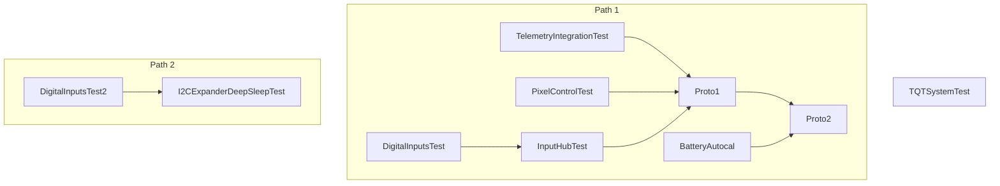

# Integration test strategy

Ensure that all unit test have failed before proceeding to integration testing (*YES, they have to fail, since their purpose is to reveal bugs, but they don't*).

- This is an incremental, bottom-up strategy.
- The `capabilities` module is always integrated but not explicitly shown below.
- Just the modules being integrated are shown.

Run order:

Render this graph at [mermaid.live](https://mermaid.live/view#pako:eNp9kE1rwzAMhv-K8bk9LMccBltTWG8pyWnkosZKYrCt4MisofS_T1m3des-dDB6pUfitU66JYM6152jl3aAyKoumqAkpnToI4yDKoEHdXcpLlGjQ48c511gFIQthRonVuv1vSojMX2BS3tEt6HAkdyfUGF7y-B2YUw8fVJv8ikdbsauaXbd8AjMGOeHxNSC-4FgML99KvvHQnbxkG22xxGCwVggjpWTZ-nerK33dTVPjH7p6ZX2GD1YI3c9LUCjeZCTNTqX1GAHyXGjm3AWFMRyNYdW5xwTrnQaDTAWFsSn_17cGssUP2qRUj_ovAM3iRKPz0T-XZ9fAeP1maE)

## *Test name*: [DigitalInputsTest](./DigitalInputsTest/README.md)

- DigitalPolledInput
  - RotaryEncoderInput
  - ButtonMatrixInput
  - AnalogMultiplexerInput
- inputs

## *Test name*: [DigitalInputsTest2](./DigitalInputsTest2/README.md)

- DigitalPolledInput
  - ShiftRegistersInput
  - I2CExpanderInput
- inputs

> [!NOTE]
> This test differs from the previous one in the involved hardware.

## *Test name*: [I2CExpanderDeepSleepTest](./I2CExpanderDeepSleepTest/README.md)

- DigitalPolledInput
  - ShiftRegistersInput
  - I2CExpanderInput
- inputs
- **power**

> [!NOTE]
> This test ensures the *inputs* subsystem properly configures interrupt pins at the GPIO expanders for wake up.

## *Test name*: [InputHubTest](./InputHubTest/README.md)

- RotaryEncoderInput
- DigitalPolledInput
- inputs
- **AnalogPolledInput**
- **userSettings**
- **inputHub**

## *Test name*: [TelemetryIntegrationTest](./TelemetryIntegrationTest/README.md)

- **hidImplementation**
- **notify**

> [!NOTE]
> This test requires SimHub.

## *Test name*: [PixelControlTest](./PixelControlTest/PixelControlTest.ino)

- **hidImplementation**
- **pixels**
- **notify**

## *Test name*: [Proto1](./Proto1/README.md)

- RotaryEncoderInput
- DigitalPolledInput
- AnalogPolledInput
- inputs
- userSettings
- inputHub
- **hidImplementation**
- **notify**

> [!NOTE]
> This is a working prototype

## *Test name*: [BatteryAutocal](./BatteryAutocal/README.md)

- power
- batteryCalibration

> [!NOTE]
> Only autocalibration algorithm is tested.

## *Test name*: [Proto2](./Proto2/README.md)

- RotaryEncoderInput
- DigitalPolledInput
- AnalogPolledInput
- inputs
- userSettings
- inputHub
- hidImplementation
- notify
- **power**
- **batteryCalibration**

> [!NOTE]
> This is a system test except for the involved hardware.

## *Test name*: [TQTSystemTest](./TQTSystemTest/README.md)

This is a *big-bang* test for the [LilyGO T-QT devkit board](https://github.com/Xinyuan-LilyGO/T-QT).
