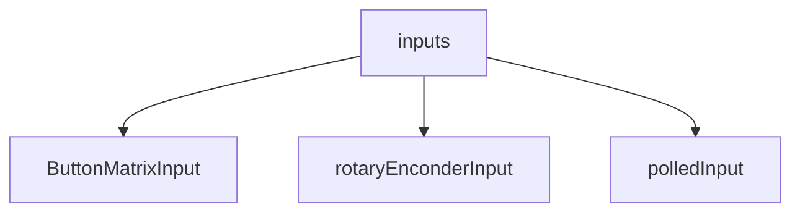
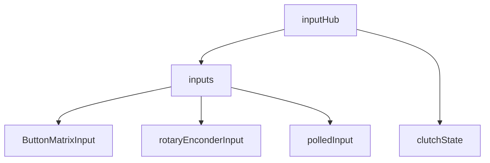
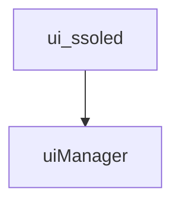
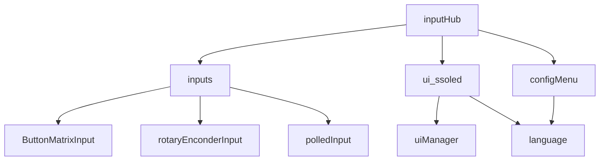
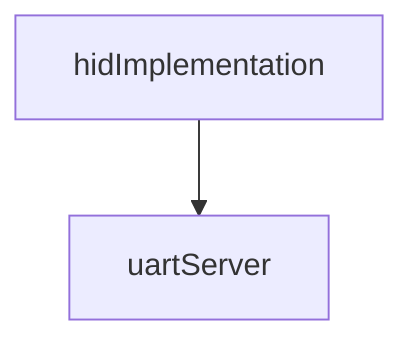
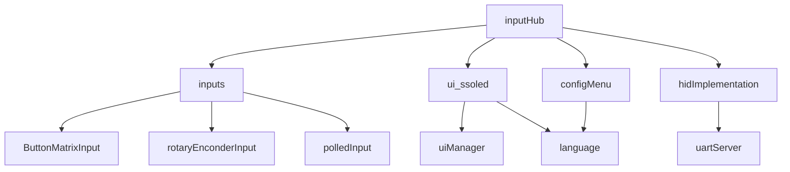
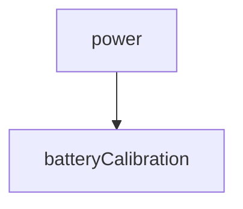
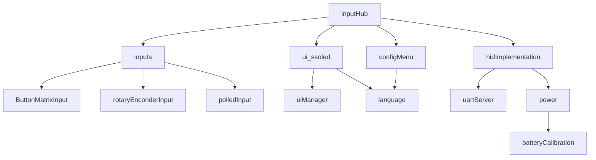

# Integration test strategy

Ensure that all unit test have failed before proceeding to integration testing (*YES, they have to fail, since their purpose is to reveal bugs, but they don't*).

**Note 1**: Just the modules being integrated are shown. _Mock_ modules are not shown.

**Note 2**: This is an incremental, bottom-up strategy.

**Note 3**: The `capabilities` module is allways integrated but not explicitly shown below.

## Step

> _Test name_: [InputsTest](./InputsTest/README.md)

## Step

> _Test name_: [InputHubTest](./InputHubTest/README.md)

## Step

> _Test name_: [uiTest](./uiTest/README.md)

_Note_: this is a unit test for `ui_ssoled`, too. 

## Step

> _Test name_: [InputHubOledTest](./InputHubOledTest/README.md)

## Step

> _Test name_: [NimBLEuartServerTest](./NimBLEuartServerTest/README.md)

## Step

> _Test name_: [Proto1](./Proto1/README.md)

_Note_: This is a working prototype

## Step

> _Test name_: [BatteryAutocal](./BatteryAutocal/README.md)

_Note_: Only autocalibrated algorithm is tested.

## Planned

> _Test name_: [Proto2](./Proto2/README.md)

_Note_: This is a system test except for the involved hardware.