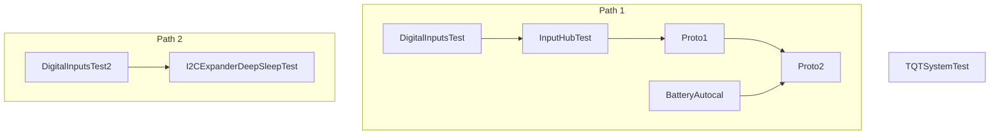

# Integration test strategy

Ensure that all unit test have failed before proceeding to integration testing (*YES, they have to fail, since their purpose is to reveal bugs, but they don't*).

- This is an incremental, bottom-up strategy.
- The `capabilities` module is always integrated but not explicitly shown below.
- Just the modules being integrated are shown.

Run order:

Render this graph at [mermaid.live](https://mermaid.live/view#pako:eNp9UMuKwkAQ_JWhz3owxxwENcJ6U5LjXNpMawbmxaQHDeK_O1HwtcvWoemuKoqiL9B6RVDCwfhT22Fk0VTSiYw-7Y8RQye2yJ2YPcgRlT5qRrNxIXHfUM9iOp2L-_mT9k9iGz372WstXglLZKY4LBL7Fs0vCzn1V4Xinwpv2qZYrc8BnaJYEYXa5DFavrKbXVMPPZMdNZiApWhRq_yKy2iQwB1ZklDmVdEBk2EJ0l2zFXPvenAtlBwTTSAFhUyVxlzWfpJrpdnHB3e9ATDidfA)

## *Test name*: [DigitalInputsTest](./DigitalInputsTest/README.md)

- DigitalPolledInput
  - RotaryEncoderInput
  - ButtonMatrixInput
  - AnalogMultiplexerInput
- inputs

## *Test name*: [DigitalInputsTest2](./DigitalInputsTest2/README.md)

- DigitalPolledInput
  - ShiftRegistersInput
  - I2CExpanderInput
- inputs

*Note:* This test differs from the previous one in the involved hardware.

## *Test name*: [I2CExpanderDeepSleepTest](./I2CExpanderDeepSleepTest/README.md)

- DigitalPolledInput
  - ShiftRegistersInput
  - I2CExpanderInput
- inputs
- **power**

*Note:* This test ensures the *inputs* subsystem properly configures interrupt pins at the GPIO expanders for wake up.

## *Test name*: [InputHubTest](./InputHubTest/README.md)

- RotaryEncoderInput
- DigitalPolledInput
- inputs
- **AnalogPolledInput**
- **userSettings**
- **inputHub**

## *Test name*: [Proto1](./Proto1/README.md)

- RotaryEncoderInput
- DigitalPolledInput
- AnalogPolledInput
- inputs
- userSettings
- inputHub
- **hidImplementation**
- **notify**

*Note*: This is a working prototype

## *Test name*: [BatteryAutocal](./BatteryAutocal/README.md)

- power
- batteryCalibration

*Note*: Only autocalibrated algorithm is tested.

## *Test name*: [Proto2](./Proto2/README.md)

- RotaryEncoderInput
- DigitalPolledInput
- AnalogPolledInput
- inputs
- userSettings
- inputHub
- hidImplementation
- notify
- **power**
- **batteryCalibration**

*Note*: This is a system test except for the involved hardware.

## *Test name*: [TQTSystemTest](./TQTSystemTest/README.md)

This is a *big-bang* test for the [LilyGO T-QT devkit board](https://github.com/Xinyuan-LilyGO/T-QT).
