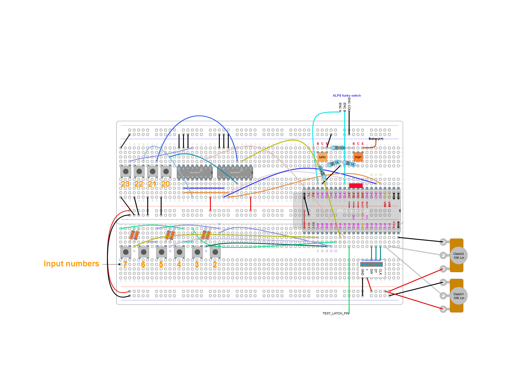

# Unit test: Input from analog potentiometer

## Purpose and summary

To test correct reading of analog axis through a potentiometer. This test involves both ADC channels.

## Hardware setup

Actual GPIO numbers are defined at [debugUtils.h](./debugUtils.h).
Use this [test circuit](../../Protoboards/TestBoard1.diy):



We are using "Clutch1" potentiometer only, wired to `TEST_ANALOG_PIN1`.
Note that `pot(-)` and `pot(+)` are interchangeable.

## Procedure and expected output

1. Reset. Ignore output from the operating system itself.
2. Output must show:

   ```text
   -- READY --
   -- GO --
   ```

3. Ignore other output.
4. Wait for 30 seconds or so. There must be no further output.
5. Move the potentiometer all the way to `pot(-)`. The last output line must show "(autocalibrated)".
6. Move the potentiometer all the way to `pot(+)`. The last output line must show "(autocalibrated)".
7. Move the potentiometer slowly towards `pot(-)`. The value `xxx` shown at `Axis: xxx` should get higher and higher (up to 254). The word "autocalibrated" must not show up.
8. Move the potentiometer slowly towards `pot(+)`. The value `xxx` shown at `Axis: xxx` should get lower and lower (down to -0). The word "autocalibrated" must not show up.
